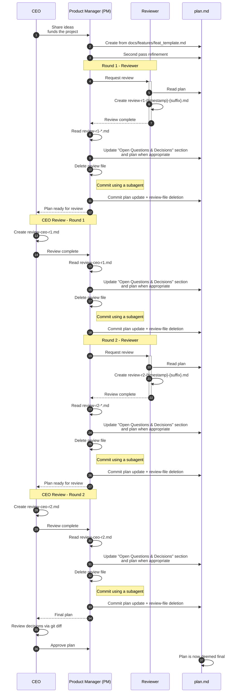

# Plan Review Pipeline Workflow



## File Structure

```
docs/features/
├── feat_template.md
└── feat-0004/
    ├── plan_agent-chain-review-artifact-recursive-feedback.md
    ├── workflow-diagram.md
    ├── review-r1-{timestamp}-{suffix}.md
    ├── review-ceo-r1.md
    ├── review-r2-{timestamp}-{suffix}.md
    └── review-ceo-r2.md
```

## Review File Naming Convention

| Reviewer | Pattern | Example |
|----------|---------|---------|
| Reviewer | `review-r{round}-{timestamp}-{suffix}.md` | `review-r1-2026-03-15_12h30_abc.md` |
| CEO | `review-ceo-r{round}.md` | `review-ceo-r1.md`, `review-ceo-r2.md` |
