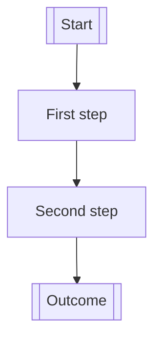

---
links:
  - "[rel path/[PRD Title]]"
  - "[Link / path / note]"
owner: "Pascal Andy"
status: "[Draft / In Progress / Ready / Shipped / Parked]"
date_updated: "[YYYY-MM-DD] / v0.1"
---

<!--
Before drafting this document, read the @pm expectations comment at the end of this file.
-->

# PRD Template

## 1. Abstract

`[Write 1-2 short paragraphs.]`

## 2. Motivation

`[Write 1-3 short paragraphs.]`

## 3. Scope Overview

### In Scope
- `[Major capability]`
- ..

### Out of Scope for This Version
- `[Deferred item]`
- ..

### Assumptions
- `[Assumption about users, distribution, implementation speed, budget, or AI support]`
- ..

## 4. Experience Overview

### Core User Journey
1. `[Start]`
2. `[User or AI takes action]`
3. `[System responds]`
4. `[Outcome is delivered]`

### Happy Path
`[Describe the default end-to-end flow.]`

### UX / Interaction Notes
`[Anything important about defaults, clarity, speed, visibility, trust, or control.]`

## 5. Functional Spec

# COMPONENT 1: `[Major Capability Area]`

### COMPONENT Goal
`[What this area is meant to accomplish.]`

### Why This COMPONENT Exists
`[What value this COMPONENT creates for the product or business.]`

### Optional Workflow Diagram



## FEAT 1.1: `[Feature Name]`

### What It Does
`[One concise paragraph describing the capability.]`

### Why It Matters
`[Why this FEAT exists and what it unlocks.]`

### How It Works
- `[Key behavior or mechanism]`
- ..
### Inputs
- `[Input source]`
- ..

### Outputs
- `[Output / artifact / visible result]`
- ..

### User-Facing Behavior
`[What the user sees, does, receives, or controls.]`

### Product Rules / Constraints
- `[Rule, limit, or product constraint]`
- ..

### Dependencies
- `[Dependency on another FEAT, asset, workflow, or prerequisite]`
- ..

### Edge Cases / Failure Handling
- `[Failure mode and expected behavior]`
- ..

### Acceptance Criteria
- `[Observable condition that proves this works]`
- ..

## 6. Cross-Cutting Concerns, Risks, and Open Questions

### Security
- `[Access, data, permission, or trust requirement]`
- `[Sensitive operation rule]`

### Reliability
- `[Failure, interruption, recovery, or fallback rule]`
- `[What should happen under partial failure]`

### Performance
- `[Latency, responsiveness, or throughput expectation]`
- `[Known tradeoff worth documenting]`

### Observability
- `[What needs to be visible during operation or after failure]`
- `[What signals indicate health or progress]`

### Known Risks
- `[Risk]`
- ..

### Unknowns
- `[Unknown that needs research, validation, or prototyping]`
- ..

### Open Questions
- `[Question]`
- ..

## 7. Delivery Plan

### Execution Tree

**COMPONENT 1 (p1) @pm**
├── FEAT 1.1 @engineer_II
├── FEAT 1.2 @engineer_II
└── ..

**COMPONENT 2 (p2) @pm ← COMPONENT 1**
├── FEAT 2.1 @engineer_II
└── FEAT 2.2 @engineer_II

**COMPONENT 3 (p3) @pm ← COMPONENT 1, COMPONENT 2**
├── FEAT 3.1 @engineer_II
└── ..

### External Dependencies
- `[Dependency]`
- ..

## 8. Annexes (Optional)

## 9. Acceptance Plan (E2E QA)

### Test Strategy
- `[Explain the overall E2E testing approach in 3-6 bullets.]`
- `[State what must be covered before ship.]`
- `[State what can be deferred.]`
- `[State what environments or data setup are required.]`

### Affected Pages/Routes
- `[URL path] — [what to test and why]`

### Key Interactions to Verify
- `[interaction description] on [page / route]`

### Edge Cases
- `[edge case] on [page / route / flow]`

### Critical Paths
- `[end-to-end flow that must work]`

### E2E Ticket List

#### 9.1 `[Atomic E2E ticket]`
- Type: `[Core flow]`
- Covers flow: `[Single user flow or validation target]`
- Covers FEATs:
  - `[FEAT 1.1]`
  - `[FEAT 1.2]`
  - `[FEAT 2.1]`
- Does not cover: `[Adjacent behavior left to another ticket]`
- Preconditions: `[Only if needed]`
- Steps:
  1. `[Step]`
  2. `[Step]`
  3. `[Step]`
- Expected result:
  - `[Result]`
  - `[Result]`

### Ship Readiness Checklist (final E2E test)
- `[All critical E2E tickets pass]`
- `[All blocker bugs from E2E are fixed or explicitly accepted]`
- `[Core user journey has atomic ticket coverage]`
- `[Important edge cases have atomic ticket coverage]`
- `[Known risks reviewed against actual E2E results]`

<!--

=—=—=—=—=—=—=—=—=—=—=—=—=—=—=
## 0. Introduction
EXPECTATIONS about this document.

This template is optimized for a solo founder working with AI assistants.

When the AI assistant has a question for the user, always leave a comment starting with the flag: 0o0o
- These four characters make it easy for the user to find items that need attention.

Use this document for:
- product focus; leave out architecture and implementation design
- scope
- workflow shape
- FEAT breakdown
- launch planning

This PRD may include build-order and acceptance-test planning when those details help define scope and ship readiness.

- definitions:
  - COMPONENT = major product area
  - FEAT = feature inside a COMPONENT

- template_version: v1.0

=—=—=—=—=—=—=—=—=—=—=—=—=—=—=
## 1. Abstract
The AI assistant must summarize what is proposed, for whom, and the expected outcome. Keep this short and concrete.

=—=—=—=—=—=—=—=—=—=—=—=—=—=—=
## 2. Motivation
The AI assistant must explain the problem, current pain, why now, and why the current state is not sufficient.
Add product, technical, or business context only when it directly helps.

=—=—=—=—=—=—=—=—=—=—=—=—=—=—=
## 3. Scope Overview
Be explicit.
For solo work, this section is one of the main defenses against accidental bloat.

=—=—=—=—=—=—=—=—=—=—=—=—=—=—=
## 5. Functional Spec
Terminology rules:
- COMPONENT = a major product area or workstream.
- FEAT = a concrete capability inside a COMPONENT.

Authoring rules:
- Organize the PRD by COMPONENTS and FEATs.
- Use optional workflow diagrams only when they clarify the experience.
- Keep implementation planning separate from product structure.
- Copy the COMPONENT block as many times as needed.
- Prefer multiple small FEATs over giant vague sections.

Workflow diagram:
- Use this only if flow or sequencing matters.
- If a COMPONENT does not need a workflow diagram, delete that subsection.
- Mermaid is preferred over tables here.
- Replace the example with a real flow only when it adds clarity.
- Do not force a diagram into every COMPONENT.

FEAT guidance:
- Keep this section product-facing.
- If the AI assistant feels tempted to specify schema fields or endpoint payloads, move that to the Technical Spec.
- Duplicate more FEAT blocks as needed by copying FEAT 1.1 and trimming or expanding it based on the actual FEAT.

Additional COMPONENTS:
- Add as many COMPONENTS as needed.
- Recommended pattern:
  - COMPONENTS describe the product shape.
  - FEATs describe the capabilities.
- Do not rewrite the template for each COMPONENT unless the COMPONENT genuinely needs a different shape.

=—=—=—=—=—=—=—=—=—=—=—=—=—=—=
## 6. Cross-Cutting Concerns, Risks, and Open Questions
Do not hide uncertainty.
Do not let the cross-cutting checklist bury:
- the real risks
- unknowns
- unresolved questions

This section should help the AI assistant decide whether to ship, prototype, or narrow scope.

=—=—=—=—=—=—=—=—=—=—=—=—=—=—=
## 7. Delivery Plan
Keep this simple.
- Use only the planning concepts defined in this template.
- Do not invent additional frameworks, labels, or sections here.
- If planning gets detailed, move it to a separate execution or project plan.
- This section is for build order only.
- Stay anchored to COMPONENTS and FEATs.

Keys:
  ```yaml
  priority:
    p1: high
    p2: medium
    p3: low
    # p0 and p4 are reserved

  assignee:
    @pm: Product Manager
    @engineer_I: Entry SWE I
    @engineer_II: Mid SWE II (default)
    @engineer_III: Senior SWE III / Senior SWE
    @qa: Quality Assurance
    @qa-e2e: E2E Quality Assurance

  dependency:
    ←: depends on
  ```

=—=—=—=—=—=—=—=—=—=—=—=—=—=—=
## 8. Annexes (Optional)
Use this section as annex material if needed.
Only for useful supporting material that helps execution or review, but does not belong in the core PRD structure.

Examples:
- links to related issues, tasks, or project notes, reference maps
- official docs, market references, or policy pages
- diagrams, mockups, or external artifacts

Keep it lightweight.
Do not move core product requirements here.

Annex examples:
- Related Issues / Tasks
- Official Docs / References
- Diagrams / Artifacts
- Other Notes

=—=—=—=—=—=—=—=—=—=—=—=—=—=—=
## 9. Acceptance Plan (E2E QA)
This section is extremely important.

The AI assistant should strongly recommend this section by default.
It may be skipped only for very small FEATs or COMPONENTS with no meaningful end-to-end flow and no separate acceptance risk.

Rules:
- plan the E2E work as separate tickets
- make each ticket atomic and easy to validate
- prefer many small tests over a few large tests
- make it obvious what each ticket covers and what it does not cover
- each E2E ticket should verify one flow, one edge case, or one failure mode
- do not write vague test buckets such as "test onboarding" or "test payments"

Good:
- "User signs up with valid email"
- "User sees validation error for invalid email"
- "User retries payment after card decline"

Bad:
- "Test auth"
- "Test checkout"
- "Test everything around uploads"

Before writing the `9.x` tickets, the AI assistant should identify:
- critical paths that must work before ship
- important edge cases
- affected pages/routes if this is a UI product
- key interactions to verify if this is a UI product
- how tests are run (for example via `just`) when that context helps define the acceptance plan
- which behaviors need unit, integration, or E2E coverage at a high level

Delete any subsection that does not apply.
Do not add API contracts, CLI contracts, service contracts, or technical design material here.

Ticketing rules:
- Every E2E test must become its own ticket under section `9.x`.
- Every ticket must be independently executable.
- Every ticket must have a single clear pass/fail outcome.
- Every ticket must name the exact flow, edge case, or failure mode being tested.
- Every ticket must explicitly list the FEAT IDs it covers.
- A single atomic E2E ticket may cover multiple FEATs.
- Use explicit references such as `FEAT 1.1`, `FEAT 1.2`, `FEAT 2.3`.
- Use `Preconditions` only when the test needs specific state, data, or environment setup.
- Add as many `9.x` atomic E2E tickets as needed.

About beads:
- When creating beads (`bd`) tasks, assignee="qa-e2e"
- In beads, they live under an EPIC. That Beads EPIC is a task-management concept.
- Recommended approach:
  - for each COMPONENT, create the implementation EPIC first
  - then create a separate code-review EPIC using skill `review-diff`
  - then create a separate Acceptance Plan (E2E QA) EPIC
  - the Acceptance Plan (E2E QA) EPIC must depend on the previous implementation EPICs it needs
  - create one child beads task per `9.x` E2E ticket under the Acceptance Plan (E2E QA) EPIC
  - create logical dependencies between these EPICs
- These tests should not be run by the developer who implemented the related FEATs.
- They should be run by someone else acting as the tester.
- That is why this work lives in a separate Beads EPIC.

The AI assistant should generate enough atomic tickets so that:
- the main flows are covered
- the important failures are covered
- each ticket stays small and easy to execute

-->
