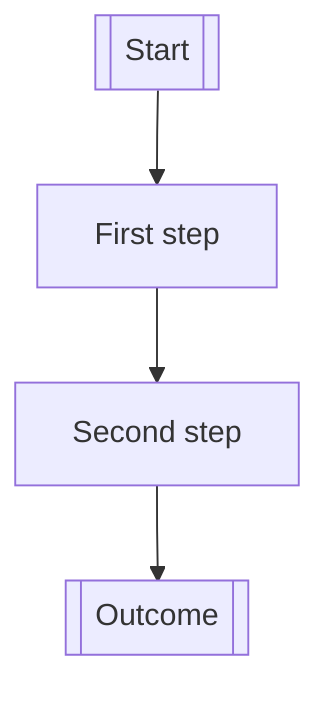

# PRD Template

<!--
This template is optimized for a solo founder working with AI assistants.

When you have a question for the user, always use the flag: 0o0o
- These four characters make it easy for the user to find items that need attention.

Use this document for:
- product focus, leave the technical details out
- scope
- workflow shape
- FEAT breakdown
- launch planning

- definitions:
  - COMPONENT = major product area
  - FEAT = feature inside a COMPONENT

-->

## 1. Abstract

<!-- The assistant AI must summarize what is proposed, for whom, and the expected outcome. Keep this short and concrete. -->

`[Write 1-2 short paragraph.]`

## 2. Motivation

<!-- The assistant AI must explain the problem, current pain, why now, and why the current state is not sufficient. Add product, technical, or business context only when it directly helps. -->

`[Write 1-3 short paragraphs.]`

## 3. Scope Overview

### In Scope
- `[Major capability]`
- `[Major capability]`
- `[Major capability]`

### Out of Scope for This Version
- `[Deferred item]`
- `[Deferred item]`

### Assumptions
- `[Assumption about users, distribution, implementation speed, budget, or AI support]`
- `[Assumption about users, distribution, implementation speed, budget, or AI support]`

<!--
Be explicit.
For solo work, this section is one of the main defenses against accidental bloat.
-->

## 4. Experience Overview

### Core User Journey
1. `[Start]`
2. `[User or AI takes action]`
3. `[System responds]`
4. `[Outcome is delivered]`

### Happy Path
`[Describe the default end-to-end flow.]`

### Important Edge Cases
- `[Edge case]`
- `[Edge case]`
- `[Edge case]`

### UX / Interaction Notes
`[Anything important about defaults, clarity, speed, visibility, trust, or control.]`

## 5. Functional Spec

<!--
Terminology rules:
- COMPONENT = a major product area or workstream.
- FEAT = a concrete capability inside a COMPONENT.

Authoring rule:
- Organize the PRD by COMPONENTS and FEATs.
- Use optional workflow diagrams only when they clarify the experience.
- Keep implementation planning separate from product structure.
-->

<!--
Copy the COMPONENT block as many times as needed.
Prefer multiple small FEATs over giant vague sections.
-->

# COMPONENT 1: `[Major Capability Area]`

### COMPONENT Goal
`[What this area is meant to accomplish.]`

### Why This COMPONENT Exists
`[What value this COMPONENT creates for the product or business.]`

### Optional Workflow Diagram

<!--
Use this only if flow or sequencing matters.
If this COMPONENT does not need a workflow diagram, delete this subsection.
Mermaid is preferred over tables here.
-->

<!--
Replace the example with a real flow only when it adds clarity.
Do not force a diagram into every COMPONENT.
-->

## FEAT 1.1: `[Feature Name]`

### What It Does
`[One concise paragraph describing the capability.]`

### Why It Matters
`[Why this FEAT exists and what it unlocks.]`

### How It Works
- `[Key behavior or mechanism]`
- `[Key behavior or mechanism]`
- `[Key behavior or mechanism]`

### Inputs
- `[Input source]`
- `[Input source]`

### Outputs
- `[Output / artifact / visible result]`
- `[Output / artifact / visible result]`

### User-Facing Behavior
`[What the user sees, does, receives, or controls.]`

### Product Rules / Constraints
- `[Rule, limit, or product constraint]`
- `[Rule, limit, or product constraint]`

### Dependencies
- `[Dependency on another FEAT, asset, workflow, or prerequisite]`
- `[Dependency on another FEAT, asset, workflow, or prerequisite]`

### Edge Cases / Failure Handling
- `[Failure mode and expected behavior]`
- `[Failure mode and expected behavior]`

### Acceptance Criteria
- `[Observable condition that proves this works]`
- `[Observable condition that proves this works]`
- `[Observable condition that proves this works]`

<!--
Keep this section product-facing.
If you feel tempted to specify schema fields or endpoint payloads, move that to the Technical Spec.
-->

<!--
## FEAT 1.2: `[Feature Name]`
## FEAT 1.3: `[Feature Name]`

Duplicate more FEAT blocks as needed:
- copy FEAT 1.1 and trim or expand it based on the actual FEAT
- etc.
-->

<!--
# COMPONENT 2: `[Major Capability Area]`
# COMPONENT 3: `[Major Capability Area]`

Add as many COMPONENTS as needed.
Recommended pattern:
- COMPONENTS describe the product shape.
- FEATs describe the capabilities.

Do not rewrite the template for each COMPONENT unless the COMPONENT genuinely needs a different shape.
-->

## 6. Cross-Cutting Concerns

### Security
- `[Access, data, permission, or trust requirement]`
- `[Sensitive operation rule]`

### Reliability
- `[Failure, interruption, recovery, or fallback rule]`
- `[What should happen under partial failure]`

### Performance
- `[Latency, responsiveness, or throughput expectation]`
- `[Known tradeoff worth documenting]`

### Observability
- `[What needs to be visible during operation or after failure]`
- `[What signals indicate health or progress]`

### Compliance / Legal / Trust
- `[Only if relevant]`

## 7. Risks, Unknowns, and Open Questions

### Known Risks
- `[Risk]`
- `[Risk]`
- `[Risk]`

### Unknowns
- `[Unknown that needs research, validation, or prototyping]`
- `[Unknown that needs research, validation, or prototyping]`

### Open Questions
- `[Question]`
- `[Question]`
- `[Question]`

<!--
Do not hide uncertainty.
This section should help you decide whether to ship, prototype, or narrow scope.

-->

## 8. Delivery Plan

### Recommended Delivery Breakdown

<!--
This section is for build order only.
Do not introduce new planning concepts here.
Stay anchored to COMPONENTS and FEATs.
-->

- `COMPONENT 1`
  - Build first because: `[Reason]`
  - FEATs to include first: `[FEAT 1.1]`, `[FEAT 1.2]`
  - Expected output: `[Shippable result]`
- `COMPONENT 2`
  - Build after: `[COMPONENT / dependency]`
  - FEATs to include first: `[FEAT 2.1]`
  - Expected output: `[Shippable result]`
- `COMPONENT 3`
  - Build after: `[COMPONENT / dependency]`
  - FEATs to include first: `[FEAT 3.1]`
  - Expected output: `[Shippable result]`

### Dependencies
- `[Dependency]`
- `[Dependency]`

<!--
Keep this simple.
If planning gets detailed, move it to a separate execution or project plan.
-->

## 9. Acceptance Plan (E2E QA)

<!--
This section is extremely important.

The assistant AI must treat this section as mandatory, not optional.

Rules:
- plan the E2E work as separate tickets
- make each ticket atomic and easy to validate
- prefer many small tests over a few large tests
- make it obvious what each ticket covers and what it does not cover
- each E2E ticket should verify one flow, one edge case, or one failure mode
- do not write vague test buckets such as "test onboarding" or "test payments"

Good:
- "User signs up with valid email"
- "User sees validation error for invalid email"
- "User retries payment after card decline"

Bad:
- "Test auth"
- "Test checkout"
- "Test everything around uploads"
-->

<!--
Before writing the `9.x` tickets, the assistant AI should identify:
- critical paths that must work before ship
- important edge cases
- affected pages/routes if this is a UI product
- key interactions to verify if this is a UI product
- required environments and how tests are run (for example via `just`)
- what should be covered by unit, integration, and E2E tests

Use these prompts only when they materially reduce ambiguity.
Delete any subsection that does not apply.
Do not add API contracts, CLI contracts, service contracts, or technical design material here.
-->

### Test Strategy
- `[Explain the overall E2E testing approach in 3-6 bullets.]`
- `[State what must be covered before ship.]`
- `[State what can be deferred.]`
- `[State what environments or data setup are required.]`

### Affected Pages/Routes
- `[URL path] — [what to test and why]`

### Key Interactions to Verify
- `[interaction description] on [page / route]`

### Edge Cases
- `[edge case] on [page / route / flow]`

### Critical Paths
- `[end-to-end flow that must work]`

### E2E Ticket List

#### 9.1 `[Atomic E2E ticket]`
- Type: `[Core flow]`
- Covers flow: `[Single user flow or validation target]`
- Covers FEATs:
  - `[FEAT 1.1]`
  - `[FEAT 1.2]`
  - `[FEAT 2.1]`
- Does not cover: `[Adjacent behavior left to another ticket]`
- Preconditions: `[Only if needed]`
- Steps:
  1. `[Step]`
  2. `[Step]`
  3. `[Step]`
- Expected result:
  - `[Result]`
  - `[Result]`

<!--
Ticketing Rules:
- Every E2E test must become its own ticket under section `9.x`.
- Every ticket must be independently executable.
- Every ticket must have a single clear pass/fail outcome.
- Every ticket must name the exact flow, edge case, or failure mode being tested.
- Every ticket must explicitly list the FEAT IDs it covers.
- A single atomic E2E ticket may cover multiple FEATs.
- Use explicit references such as `FEAT 1.1`, `FEAT 1.2`, `FEAT 2.3`.
- Use `Preconditions` only when the test needs specific state, data, or environment setup.
-->

<!--
Add as many #### 9.x `[Atomic E2E ticket]` as needed
-->

### Ship Readiness Checklist (final E2E test)
- `[All critical E2E tickets pass]`
- `[All blocker bugs from E2E are fixed or explicitly accepted]`
- `[Core user journey has atomic ticket coverage]`
- `[Important edge cases have atomic ticket coverage]`
- `[Known risks reviewed against actual E2E results]`

<!--
About beads:
When creating beads (`bd`) tasks, treat these E2E tickets as real tracked tasks in the task manager.
In beads, they live under an EPIC. That Beads EPIC is a task-management concept.

Recommended approach:
- for each COMPONENT, create the implementation EPIC first
- then create a separate code-review EPIC using skill `review-diff`
- then create a separate Acceptance Plan (E2E QA) EPIC
- the Acceptance Plan (E2E QA) EPIC must depend on the previous implementation EPICs it needs
- create one child beads task per `9.x` E2E ticket under the Acceptance Plan (E2E QA) EPIC
- create logical dependencies between these EPICs

These tests should not be run by the developer who implemented the related FEATs.
They should be run by someone else acting as the tester.
That is why this work lives in a separate Beads EPIC.
-->

<!--
This is not just a QA summary.
This section is a real test-planning artifact (while the tests within the FEAT section are done by the Devs)

The assistant AI should generate enough atomic tickets so that:
- the main flows are covered
- the important failures are covered
- each ticket stays small and easy to execute
-->
