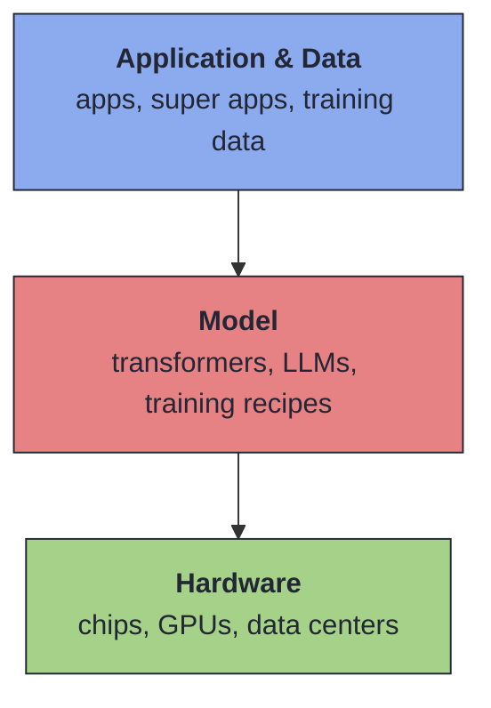

# How China Caught Up in the AI Race

The full AI stack, explained.

  
    From AlphaGo (2016) → DeepSeek and Cdance (2026)
  

  Adapted from Asian Boss · Steven Park

<!--
Pacing: ~40 minutes. Start with the AlphaGo story,
then zoom out to the three-layer stack, then climb
the stack: hardware → model → data.
-->

---
layout: section
---

# 1 · The AlphaGo Wake-Up Call

Seoul, March 2016

<!--
some notes here
-->

---
layout: two-cols-header
---

## Lee Sedol vs AlphaGo

A five-game series that rewrote two thousand years of Go theory.

::left::

### The human

- 18 international titles
- Not world #1, but widely expected to win
- Ancient game: more board states than atoms in the universe

::right::

### The machine

- Built by **DeepMind** (acquired by Google)
- Demis Hassabis + Sergey Brin flew to Seoul
- Public consensus: "machines can't beat masters"

---
transition: fade
---

## The five games

- **Game 1** — AlphaGo wins after ~4 hours. Spectators stunned.
- **Game 2** — **Move 37.** A stone no top player would place. Lee Sedol leaves the room for 15 minutes.
- **Game 3** — AlphaGo extends the lead.
- **Game 4** — Lee Sedol strikes back with *"the divine move."*
- **Game 5** — AlphaGo closes it out. Series: **4 – 1**.

Move 37 wasn't an error. It revealed a strategy  
no human had considered in 2,000 years.

---
layout: quote
---

> "Not only had a machine beaten one of the best human players in the world two games in a row — it had also revealed an entirely new strategy that no human had even considered in more than two thousand years."

---
layout: statement
---

## The West saw a milestone. China heard an alarm.

2017 — The **Next Generation Artificial Intelligence Development Plan**
 Explicit goal: become world leader in AI by 2030.

---
layout: section
---

# 2 · The AI Stack

AI is not one technology. It is three layers.

---

## The three-layer stack

The US–China rivalry plays out across <i>every</i> layer — simultaneously.

---
layout: section
---

# Layer 1 · Hardware

Silicon, GPUs, and the geopolitical chokepoint.

---

## How a microchip works

A chip is a slice of **semiconductor** with billions of **transistors** etched in.

Each transistor is a switch — **1** or **0**.

Today: tens of billions of switches on silicon the size of a fingernail.

| Material | Behaviour |
|----------|-----------|
| Copper | always ON — no control |
| Rubber | always OFF — no signal |
| **Silicon** | **flips on/off with a tiny charge** |

"Silicon can instantly switch between blocking and conducting power. 
That's why human engineers can actually control it."

---

## GPUs — the engine of AI

A **GPU** surface is a grid of thousands of tiny cores.

- Originally built to render 3D graphics
- Same *parallel* math is what AI needs
- A single video prompt = hundreds of billions of operations

### State of the art

- **Blackwell B200** — two dies, **208B transistors**
- **Rubin platform** — unveiled Jan 2026
- **$30k–$40k** per top-tier GPU
- ChatGPT-class training → **tens of thousands** wired together

The viral clip of Jensen gifting Elon a "GPU"? That was a mini supercomputer with cooling fans. 
The actual silicon is about the size of a playing card.

---
layout: two-cols-header
---

## The chokepoint

Why China can't just buy its way in.

::left::

### NVIDIA + TSMC

- **NVIDIA** (~$4.5T, Mar 2026) *designs*
- **TSMC** *manufactures*
  - ~**70%** of the global chip market
  - **90%+** of advanced AI chips
- TSMC runs on US software, patents, machinery
- US law bans advanced AI chips to China

::right::

### Why China can't copy it

- Most complex physical process in human history
- **$200M laser machines** (Netherlands)
- Ultra-pure chemicals (Japan)
- Decades of tacit engineering know-how
- Even Samsung can't fully match TSMC

Even Tesla announced **Project TerraFab** —  
TSMC can't produce enough chips to meet demand.

---
layout: statement
---

## Western experts wrote China off. They underestimated the *software* side.

---
layout: section
---

# Layer 2 · The Model

Where China proved it could compete.

---

## The transformer — 2017

An American architectural breakthrough.

### Before

- Read one word at a time, left → right
- Long sentences → model forgets context
- Reasoning breaks down

### After

- Read the **entire block at once**
- Draw invisible links between every concept
- Context never lost

Feed a transformer enough human text → a <b>Large Language Model</b>.

---
layout: quote
---

> "At its absolute core, the structure of an LLM is basically just playing the ultimate game of guess the next word."

Smartphone autocomplete × planetary context → emergent reasoning.

---
layout: section
---

# DeepSeek's two breakthroughs

How to beat bigger budgets with better code.

---

## Breakthrough 1a — Mixture of Experts (MoE)

### Dense model
Every parameter fires on every query. Enormous GPU cost.

### Standard MoE (OpenAI-era)
Split into expert clusters. Only activate what's needed.

### DeepSeek's extreme MoE

- **256 hyper-specialized experts**
- Router activates just **8 / 256** per token
- The other 248 stay asleep

Same intelligence. A fraction of the compute.

---

## Breakthrough 1b — Multi-Head Latent Attention (MLA)

- LLM short-term memory = **key-value cache**
- Normally: fat, GPU-hungry, grows with conversation
- DeepSeek invented **MLA** — aggressive cache compression
- **>90% memory reduction** while preserving reasoning

The model tracks what it's thinking —  
using a fraction of the RAM.

---

## Breakthrough 2 — PTX instead of CUDA

### CUDA
NVIDIA's standard software. 
*"The automatic transmission of AI development."*

Most labs stop here.

### PTX (Parallel Thread Execution)

A low-level assembly layer inside CUDA.

DeepSeek wrote **custom low-level code** to force older chips to communicate and compute more efficiently.

*Manual transmission.*

Could OpenAI / Anthropic do this? Yes.  
But for them it's faster to just buy more GPUs. DeepSeek had no choice.

---
layout: fact
---

## < $6M

the reported training cost of DeepSeek's world-class model

vs. hundreds of millions for comparable GPT-class models

---

## The killer feature — **open source**

- Weights and architecture released publicly
- Anyone can inspect, fine-tune, rebuild
- The community *learned* the 256-experts + MLA tricks from the release itself
- Opposite of OpenAI's closed-model posture

"DeepSeek turned its model into a platform 
and started handing out the secret recipe."

---
layout: section
---

# Training philosophy

Where the two sides diverged the most.

---
layout: two-cols-header
---

## Two approaches to teaching a brain

::left::

### Western (hybrid)

- Huge teams of annotators, domain experts
- Hand-crafted reasoning data
- Reinforcement learning layered on top
- Goal: safe, polished, commercial-ready
- **Brutally expensive**

::right::

### DeepSeek (RL-first)

- Model generates many answers itself
- Scoring system rewards / penalizes
- Learns by solving, not by imitation
- Fits a tight budget
- Born of **financial necessity**

---

## The genius who couldn't talk

- Pure RL → brilliant at math, logic, coding
- But it stopped *caring* how it sounded
- Engineers called it **"language mixing"** — unreadable English–Chinese hybrid
- Fix: a small amount of human-labeled data for presentation
- Core reasoning engine was still built for a fraction of the cost

"It turned into a genius mathematician 
who mumbles to himself and doesn't speak to normal people."

---
layout: section
---

# Layer 3 · Application & Data

The layer where China has a structural advantage.

---
layout: statement
---

## DeepSeek was a Sputnik moment.

1957: Soviets launch the first satellite. Silicon Valley, 2026: same feeling. 
A rival is catching up — through a completely different path.

---
layout: quote
---

> "If a language model is a brain trapped in a dark room that only knows how to read text — a multimodal model is a brain that has been given eyes and ears."

---

## The US data wall

- Western labs scraped the open internet — YouTube, Reddit, X, public sites
- Often without permission, probably illegally
- As of 2026: **essentially out of high-quality multimodal data**
- Musk's warning: next frontier is **synthetic data** (AI training AI)
- What's left is fragmented, compressed, lawsuit-bound

---
layout: two-cols-header
---

## China's data engine: ByteDance

::left::

### Douyin + TikTok

- Hundreds of millions of daily HD uploads
- ByteDance owns the **native, uncompressed files**
- Perfect categorization + user engagement signals
- Camera angle, lighting, the millisecond a viewer swiped away

::right::

### What the AI gets to see

- Not just "a person walking"
- Physics, reflections, audio sync
- A perfectly labeled, growing corpus
- Behind the Great Firewall — walled off from Western labs

"An infinitely growing, perfectly labeled database that lives entirely behind the Chinese internet wall."

---

## Cdance 2.0 vs Sora

### Sora (OpenAI)

- Physical inconsistencies
- Audio-visual drift
- Visual hallucinations
- Hitting the limits of scrapeable data

### Cdance 2.0 (ByteDance)

- **Natural motion synthesis**
- Splash behaves like water
- Reflections match the scene
- Sound lines up with the frame

ByteDance's chatbot <b>DuoBao</b> has already passed DeepSeek as China's #1 AI app. 
Text + image + cinematic video + voice — in one place.

---
layout: statement
---

## The flip side

China's models will eventually struggle to understand 
Western culture, physics, cityscapes.
  
They'll hit the same data wall — <b>from the opposite direction</b>.

---
layout: quote
---

> "The AI race is far from over. It's just shifting to a new battlefield."

---
layout: section
---

# The next frontier

Data that isn't on the internet yet.

---

## Beyond the screen

- **AI agents** that act in the real world
- **Physical robots** in homes, factories, cars
- The richest remaining data is offline:
  - Real conversations
  - Physical workflows
  - Lived human context

"If the future of AI requires understanding real human beings, 
the most valuable data won't come from scraping websites. 
It'll come from actually talking to people."

---
layout: section
---

# Takeaways

---

## What to remember

1. AI is a **3-layer stack** — hardware, model, data.
2. US owns the hardware chokepoint. NVIDIA + TSMC + export controls.
3. China answered with **software efficiency** — 256-expert MoE, MLA, PTX.
4. DeepSeek trained a world-class model for **< $6M**, then open-sourced it.
5. China's structural edge is **multimodal data** from super apps.
6. Both sides face a data wall — from opposite directions.
7. The next battlefield is **real-world data** that doesn't exist online yet.

---

## Glossary (1/2)

| Term | Meaning |
|------|---------|
| Transformer | 2017 architecture reading whole text blocks in parallel |
| LLM | Transformer trained on human text → next-word prediction → reasoning |
| GPU | Chip with thousands of parallel cores, the engine of AI |
| Semiconductor | Silicon — switches between conducting and blocking |
| MoE | Mixture of Experts — activate only specialized clusters |
| MLA | Multi-Head Latent Attention — >90% cache compression |
| CUDA | NVIDIA's standard GPU software layer |
| PTX | Low-level assembly inside CUDA for custom optimization |

---

## Glossary (2/2)

| Term | Meaning |
|------|---------|
| Key-Value Cache | Model's short-term memory during a conversation |
| Multimodal | Training data across text, image, audio, video |
| Synthetic Data | AI-generated data used to train AI |
| Reinforcement Learning | Generate answer → score → reward or penalize |
| Natural Motion Synthesis | Physically consistent generated video |
| Sputnik Moment | Sudden realization a rival is ahead via a different path |
| Foundation Model | The underlying brain (GPT 5.4) beneath an app (ChatGPT) |
| Open Source | Weights + architecture public, anyone can rebuild |

---
layout: end
---

# Questions?

Source: Asian Boss — Steven Park 
`follow_along_note.md` · 2026-04-19

