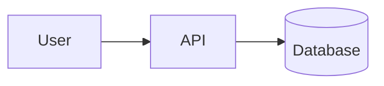
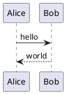

# Slidev Diagrams

Three diagram modes, each is a fenced block with a special language tag.

## Core Concept

Slidev renders diagrams at build time (or live in dev). The three supported engines:

1. **Mermaid** — native, no external server, fastest.
2. **PlantUML** — requires a PlantUML server (public by default); useful for UML styles Mermaid does not cover.
3. **LaTeX math** — rendered with KaTeX, works inline (`$...$`) or as a block (`$$...$$`).

## Routing Inside This Sub-Skill

| Intent | Open |
|---|---|
| Mermaid flowcharts, sequence, class, ER, state, gantt | [`references/diagram-mermaid.md`](references/diagram-mermaid.md) |
| PlantUML diagrams, server configuration | [`references/diagram-plantuml.md`](references/diagram-plantuml.md) |
| Inline and block LaTeX math | [`references/diagram-latex.md`](references/diagram-latex.md) |

## Canonical Patterns

**Mermaid flowchart:**

````md

````

**Mermaid with size control:**

````md

````

**PlantUML:**

````md

````

**LaTeX inline and block:**

```md
The relation $E = mc^2$ shows mass-energy equivalence.

$$
\int_0^1 x^2 \, dx = \frac{1}{3}
$$
```

## Output Contract

A good Diagrams output delivers:

1. The fenced block with the correct language tag (`mermaid`, `plantuml`) or `$`/`$$` wrappers for math.
2. For PlantUML, a note on which server is in use (default is the public `plantuml.com` server; a private server is configured in headmatter).
3. For Mermaid, any needed `{scale: …, theme: …}` options inline on the fence.

## Picking the Right Engine

| Use case | Engine |
|---|---|
| Flowchart, sequence, class, state, ERD, gantt, pie | Mermaid |
| Component, deployment, activity (BPMN-ish), Salt wireframes | PlantUML |
| Math expressions, physics formulae, logic symbols | LaTeX |
