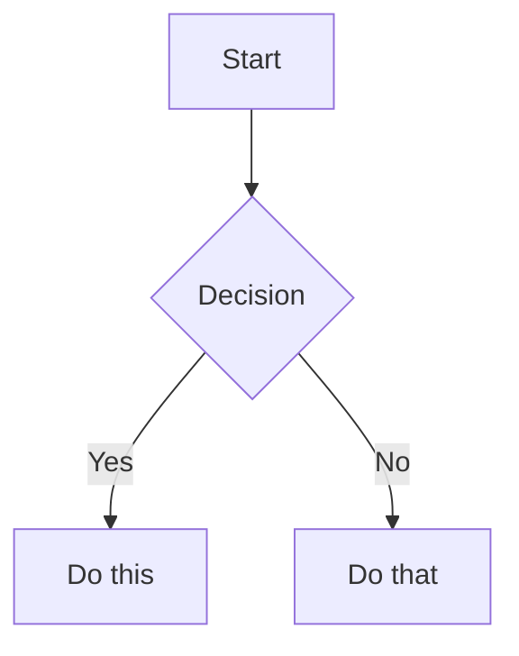

# Obsidian Flavored Markdown -- Extended Reference

This reference covers Obsidian syntax NOT in the main skill instructions: block IDs, math, Mermaid diagrams, and footnotes. For wikilinks, embeds, callouts, properties, and tags, see the main SKILL.md.

## Block IDs

Block IDs let you link to specific paragraphs, list items, or quotes.

For paragraphs, append the ID to the end of the line:

```markdown
This paragraph can be linked to. ^my-block-id
```

For lists and quotes, place the ID on a separate line after the block:

```markdown
- Item 1
- Item 2

^list-id

> A quote block

^quote-id
```

Link to a block: `[[Note Name#^block-id]]`
Embed a block: `![[Note Name#^block-id]]`

## Math (LaTeX)

```markdown
Inline: $e^{i\pi} + 1 = 0$

Block:
$$
\frac{a}{b} = c
$$
```

## Diagrams (Mermaid)

````markdown

````

To link a Mermaid node to an Obsidian note, add `class NodeName internal-link;`.

## Footnotes

```markdown
Text with a footnote[^1].

[^1]: Footnote content.

Inline footnote.^[This is inline.]
```

## Complete example

````markdown
---
title: Project Alpha
date: 2024-01-15
tags:
  - project
  - active
status: in-progress
---

# Project Alpha

This project aims to [[improve workflow]] using modern techniques.

> [!important] Key Deadline
> The first milestone is due on ==January 30th==.

## Tasks

- [x] Initial planning
- [ ] Development phase
  - [ ] Backend implementation
  - [ ] Frontend design

## Notes

The algorithm uses $O(n \log n)$ sorting. See [[Algorithm Notes#Sorting]] for details.

![[Architecture Diagram.png|600]]

Reviewed in [[Meeting Notes 2024-01-10#Decisions]]. ^review-block
````
