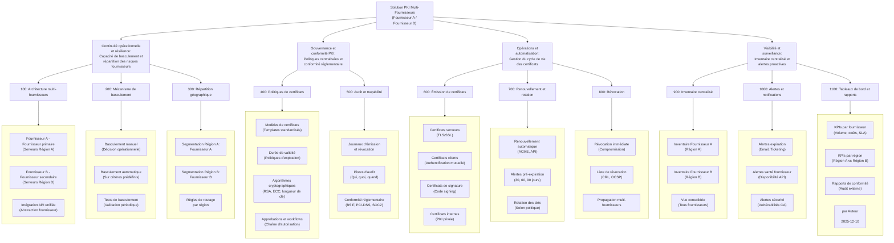

# Analyse de la Solution PKI Multi-Fournisseurs (Fournisseur A / Fournisseur B)

## Diagramme de Contexte - Structure de la Solution

```mermaid
graph TB

A["Solution PKI Multi-Fournisseurs<br/>(Fournisseur A / Fournisseur B)"]

A --> B1["Continuité opérationnelle<br/>et résilience:<br/>Capacité de basculement et<br/>répartition des risques fournisseurs"]
A --> B2["Gouvernance et<br/>conformité PKI:<br/>Politiques centralisées et<br/>conformité réglementaire"]
A --> B3["Opérations et<br/>automatisation:<br/>Gestion du cycle de vie<br/>des certificats"]
A --> B4["Visibilité et<br/>surveillance:<br/>Inventaire centralisé et<br/>alertes proactives"]

B1 --> C1["100: Architecture multi-fournisseurs"]
B1 --> C2["200: Mécanisme de basculement"]
B1 --> C3["300: Répartition géographique"]

B2 --> C4["400: Politiques de certificats"]
B2 --> C5["500: Audit et traçabilité"]

B3 --> C6["600: Émission de certificats"]
B3 --> C7["700: Renouvellement et rotation"]
B3 --> C8["800: Révocation"]

B4 --> C9["900: Inventaire centralisé"]
B4 --> C10["1000: Alertes et notifications"]
B4 --> C11["1100: Tableaux de bord et rapports"]

C1 --> D1
subgraph D1[" "]
D1a["Fournisseur A - Fournisseur primaire<br/>(Serveurs Région A)"]
D1b["Fournisseur B - Fournisseur secondaire<br/>(Serveurs Région B)"]
D1c["Intégration API unifiée<br/>(Abstraction fournisseur)"]
end

C2 --> D2
subgraph D2[" "]
D2a["Basculement manuel<br/>(Décision opérationnelle)"]
D2b["Basculement automatique<br/>(Sur critères prédéfinis)"]
D2c["Tests de basculement<br/>(Validation périodique)"]
end

C3 --> D3
subgraph D3[" "]
D3a["Segmentation Région A:<br/>Fournisseur A"]
D3b["Segmentation Région B:<br/>Fournisseur B"]
D3c["Règles de routage<br/>par région"]
end

C4 --> D4
subgraph D4[" "]
D4a["Modèles de certificats<br/>(Templates standardisés)"]
D4b["Durée de validité<br/>(Politiques d'expiration)"]
D4c["Algorithmes cryptographiques<br/>(RSA, ECC, longueur de clé)"]
D4d["Approbations et workflows<br/>(Chaîne d'autorisation)"]
end

C5 --> D5
subgraph D5[" "]
D5a["Journaux d'émission<br/>et révocation"]
D5b["Pistes d'audit<br/>(Qui, quoi, quand)"]
D5c["Conformité réglementaire<br/>(BSIF, PCI-DSS, SOC2)"]
end

C6 --> D6
subgraph D6[" "]
D6a["Certificats serveurs<br/>(TLS/SSL)"]
D6b["Certificats clients<br/>(Authentification mutuelle)"]
D6c["Certificats de signature<br/>(Code signing)"]
D6d["Certificats internes<br/>(PKI privée)"]
end

C7 --> D7
subgraph D7[" "]
D7a["Renouvellement automatique<br/>(ACME, API)"]
D7b["Alertes pré-expiration<br/>(30, 60, 90 jours)"]
D7c["Rotation des clés<br/>(Selon politique)"]
end

C8 --> D8
subgraph D8[" "]
D8a["Révocation immédiate<br/>(Compromission)"]
D8b["Liste de révocation<br/>(CRL, OCSP)"]
D8c["Propagation multi-fournisseurs"]
end

C9 --> D9
subgraph D9[" "]
D9a["Inventaire Fournisseur A<br/>(Région A)"]
D9b["Inventaire Fournisseur B<br/>(Région B)"]
D9c["Vue consolidée<br/>(Tous fournisseurs)"]
end

C10 --> D10
subgraph D10[" "]
D10a["Alertes expiration<br/>(Email, Ticketing)"]
D10b["Alertes santé fournisseur<br/>(Disponibilité API)"]
D10c["Alertes sécurité<br/>(Vulnérabilités CA)"]
end

C11 --> D11
subgraph D11[" "]
D11a["KPIs par fournisseur<br/>(Volume, coûts, SLA)"]
D11b["KPIs par région<br/>(Région A vs Région B)"]
D11c["Rapports de conformité<br/>(Audit externe)"]
D11d["par Auteur<br/><br/>2025-12-10"]
end
```
