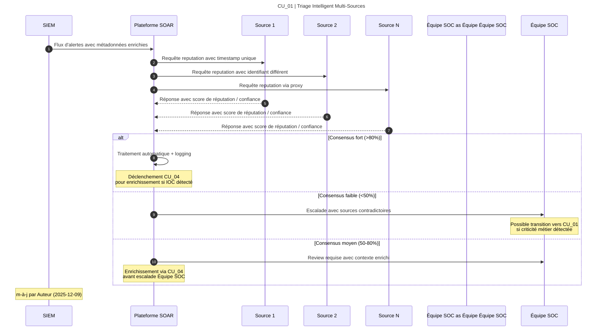
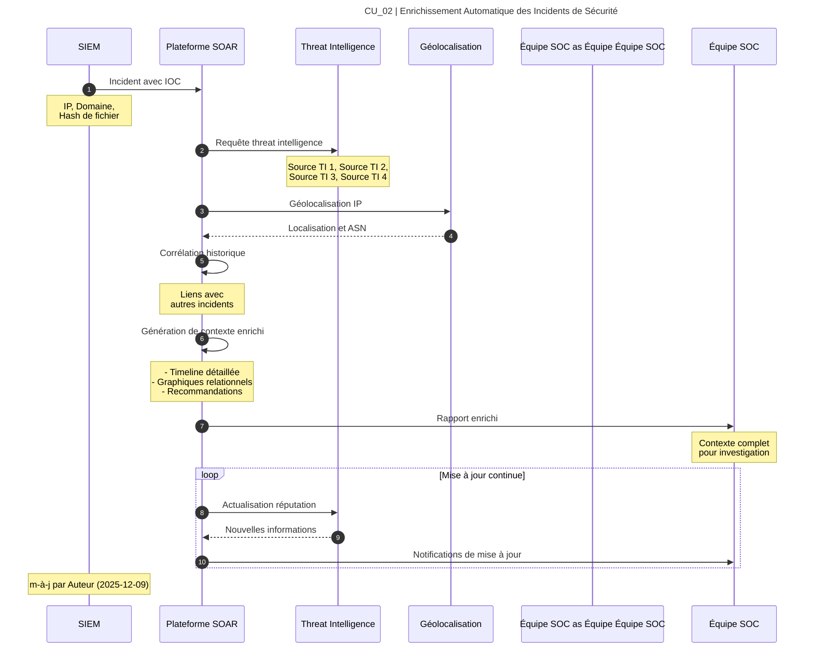
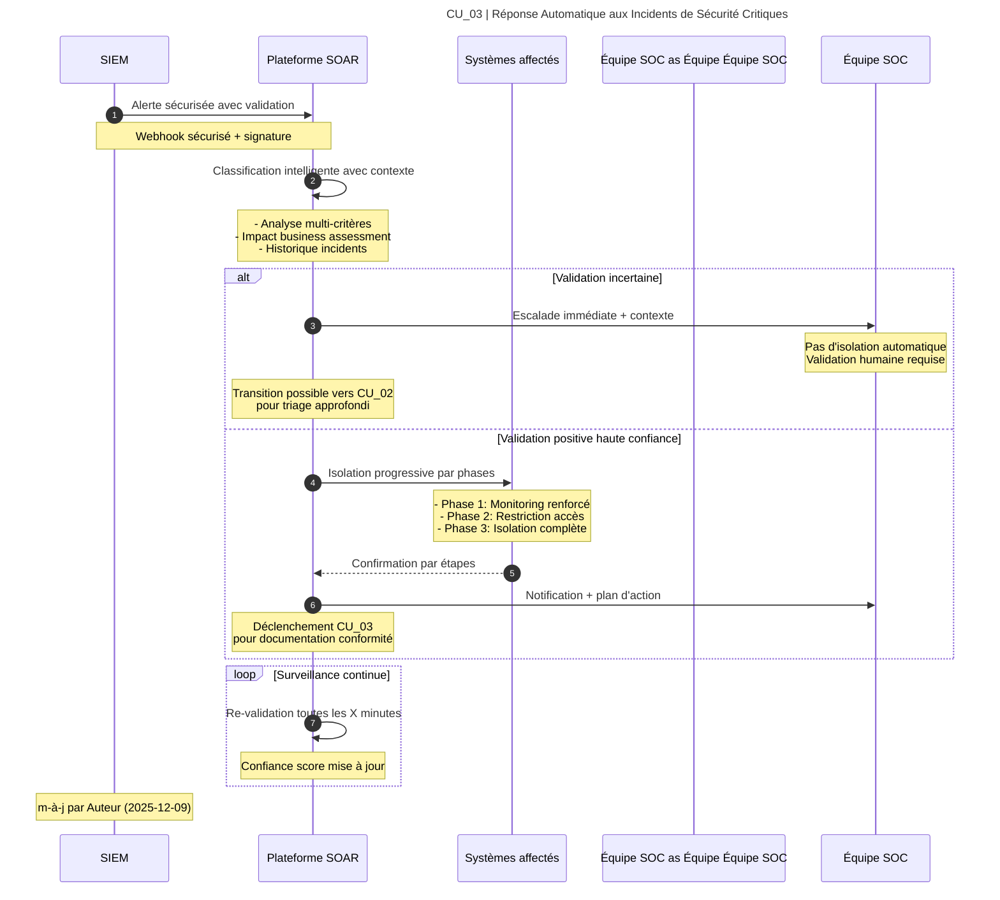
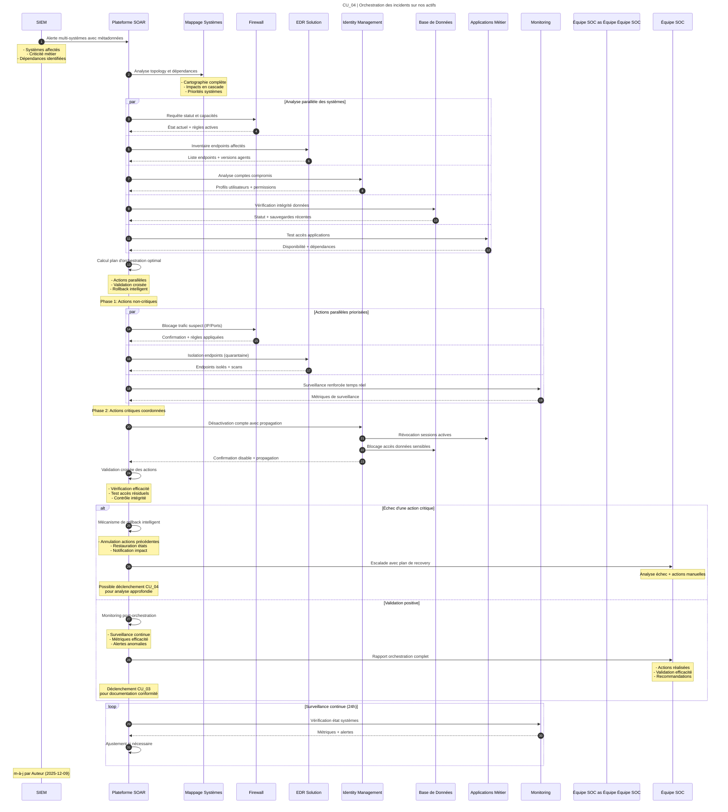
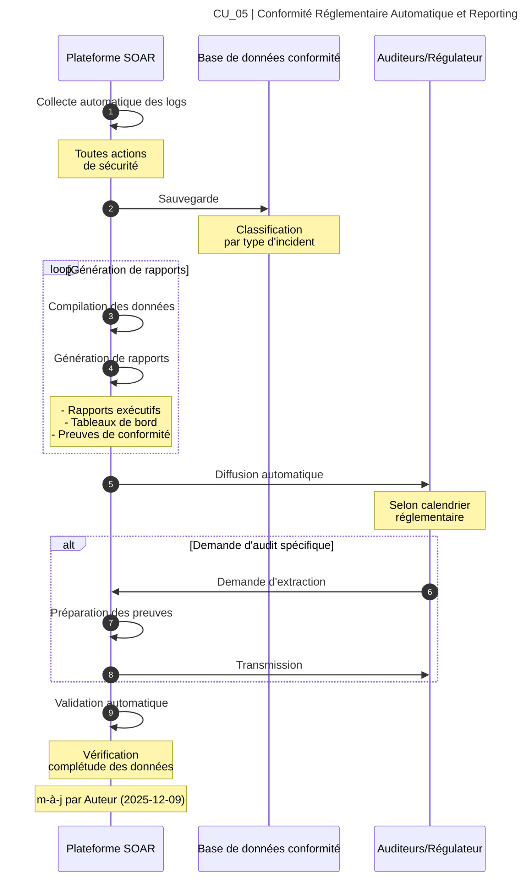

# Cas d'utilisation et leur processus / Plateforme SOAR

---

## CU_01 | Triage Intelligent et Priorisation des Alertes de Sécurité

### Valeur d'affaires

- Élimination des alertes non-critiques (réduction du bruit)
- Optimisation des ressources de l'équipe Équipe SOC
- Accélération de la détection des vraies menaces
- Réduction des coûts opérationnels de surveillance

### Processus

---

## CU_02 | Enrichissement Automatique des Incidents de Sécurité

### Valeur d'affaires

- Amélioration de la qualité des investigations
- Réduction du temps d'analyse manuelle
- Meilleure compréhension du contexte des incidents
- Optimisation des décisions de réponse

### Processus

---

## CU_03 | Réponse Automatique aux Incidents de Sécurité Critiques

### Valeur d'affaires

- Réduction drastique du temps de réponse aux menaces
- Prévention des pertes financières majeures et des dommages à la réputation
- Conformité automatique aux exigences réglementaires BSIF/OSFI
- Minimisation de l'intervention humaine lors d'incidents critiques

### Processus

---

## CU_04 | Orchestration des Réponses Multi-Systèmes

### Valeur d'affaires

- Coordination cohérente des actions sur tous les systèmes
- Élimination des erreurs manuelles lors des interventions
- Réduction du temps de remédiation
- Amélioration de l'efficacité opérationnelle

### Processus

---

## CU_05 | Conformité Réglementaire Automatique et Reporting

### Valeur d'affaires

- Conformité automatique aux exigences BSIF/OSFI
- Réduction des risques de pénalités réglementaires
- Transparence complète des activités de sécurité pour les auditors
- Rationalisation des processus d'audit et de certification

### Processus

