Plan
- Clarify audience and objective (bank BA, one-pager).
- Capture core SAST/SCA capabilities plus integrations.
- Map workflows, governance, and high-value use cases.
- Render as a Mermaid `graph TB` for quick storytelling.

```mermaid
graph TB
    A["SAST/SCA Platform"]

    A --> B["Code Security (SAST)"]
    B --> B1["Static analysis rules & dataflow"]
    B --> B2["IDE/PR feedback & autofix hints"]
    B --> B3["Pipeline gates & quality baselines"]

    A --> C["Dependency Security (SCA)"]
    C --> C1["SBOM & inventory"]
    C --> C2["Vulnerability feed + exploit context"]
    C --> C3["License compliance & policies"]
    C --> C4["Upgrade guidance & safe versions"]

    A --> D["Workflow & Response"]
    D --> D1["Triage/false-positive handling"]
    D --> D2["Owner assignment & ticketing"]
    D --> D3["Remediation guidance & exceptions"]
    D --> D4["Ageing SLAs & auto reminders"]

    A --> E["Use Cases"]
    E --> E1["Shift-left guardrails (IDE/pre-commit)"]
    E --> E2["Release gates & risk sign-off"]
    E --> E3["Audit-ready evidence (regulators/PCI)"]
    E --> E4["Risk trending KPIs for leadership"]

    A --> F["Integrations"]
    F --> F1["CI/CD (Jenkins, GitHub/GitLab)"]
    F --> F2["Issue trackers & chat alerts"]
    F --> F3["SIEM/GRC exports"]

    A --> G["Reporting"]
    G --> G1["Dashboards by app/team"]
    G --> G2["Drill-down to fix paths"]
```

