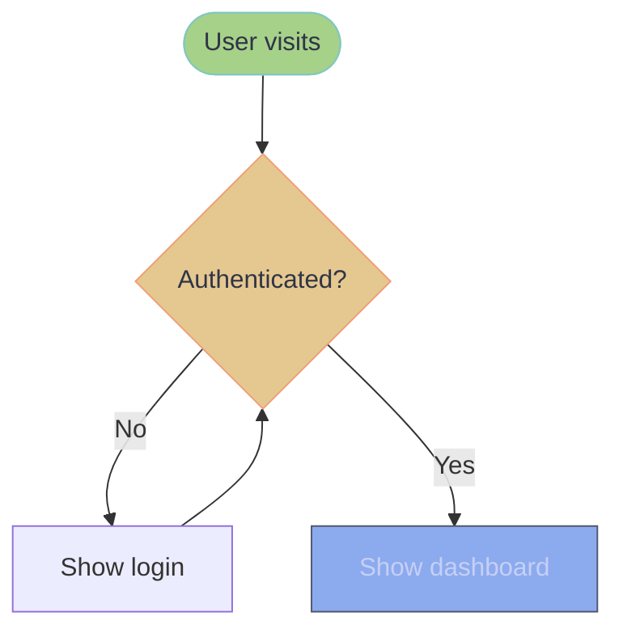
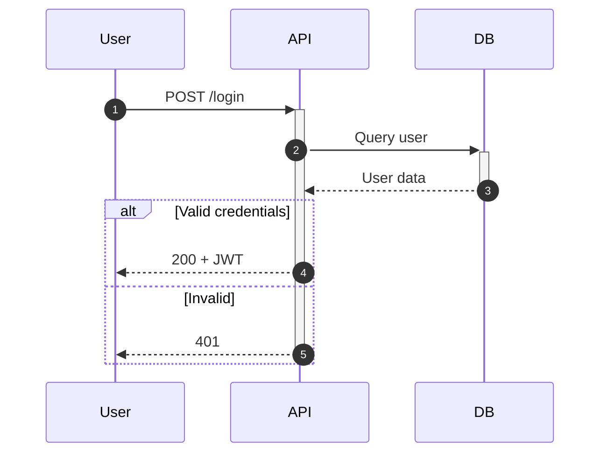
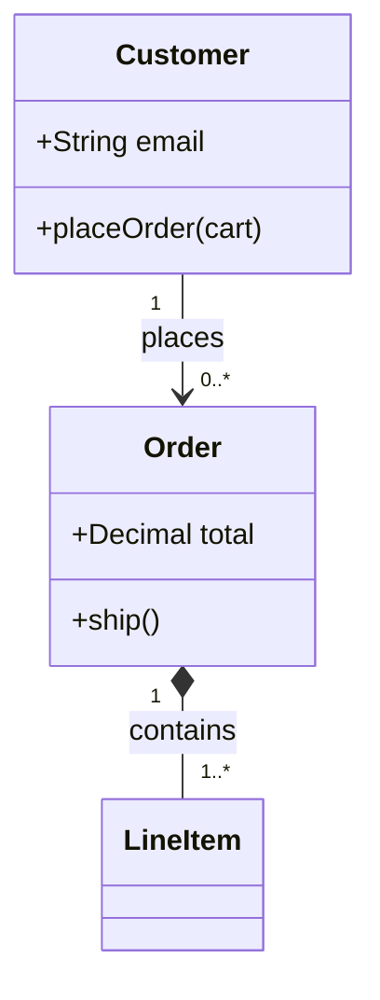
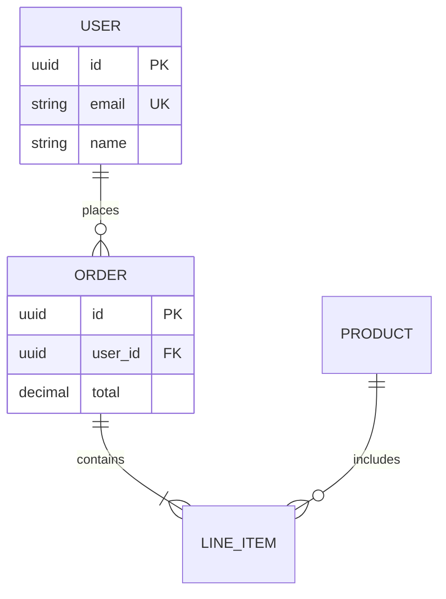
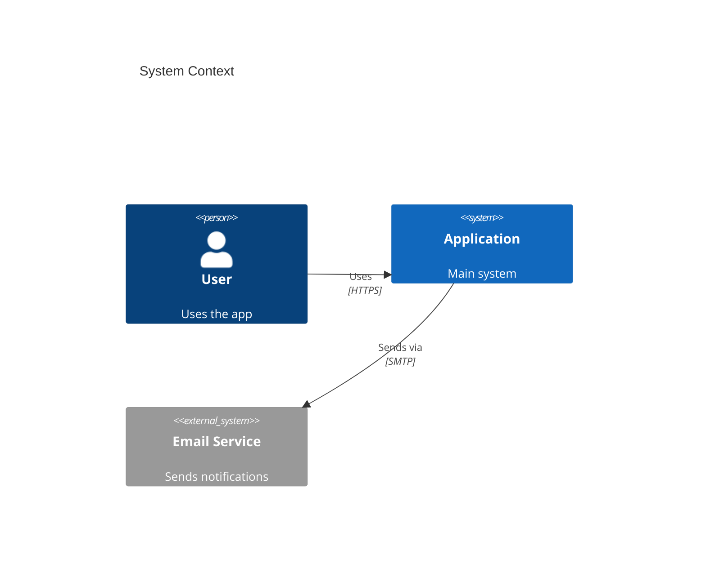
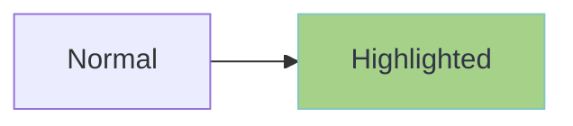
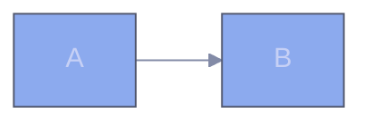

# Mermaid

Text-based diagrams that render in Markdown, GitHub, Obsidian, and most documentation platforms.

## Core Rules

1. **Quote all labels** containing special characters or spaces: `A["Node (with parens)"]`
2. **No emojis** in diagrams (compatibility and professionalism)
3. **Use short, descriptive IDs**: `api`, `db`, `userSvc` not `applicationProgrammingInterface`
4. **Use Catppuccin Frappe colors** for all styling (see Quick Color Reference below)

**REQUIRED SUB-SKILL:** Use `std-color-palette-frappe` for complete color palette reference.

## Quick Color Reference (Catppuccin Frappe)

| Purpose | Color | Hex |
|---------|-------|-----|
| Primary/Default | Blue | `#8caaee` |
| Success/Start | Green | `#a6d189` |
| Error/Stop | Red | `#e78284` |
| Warning | Yellow | `#e5c890` |
| Info/Highlight | Teal | `#81c8be` |
| Accent | Peach | `#ef9f76` |
| Text (on dark) | Text | `#c6d0f5` |
| Background | Base | `#303446` |
| Border/Stroke | Surface 1 | `#51576d` |

## Diagram Type Selection

| Need to show | Use | Reference |
|--------------|-----|-----------|
| Process, algorithm, decision tree | Flowchart | `references/flowcharts.md` |
| API flow, temporal interaction | Sequence | `references/sequence-diagrams.md` |
| Domain model, OOP design | Class | `references/class-diagrams.md` |
| Database schema, tables | ERD | `references/erd-diagrams.md` |
| System architecture (multi-level) | C4 | `references/c4-diagrams.md` |
| Styling, themes, config | Advanced | `references/advanced-features.md` |

## Quick Start

### Flowchart

**Directions:** `TD` (top-down), `LR` (left-right), `BT`, `RL`

**Node shapes:**
- `[text]` rectangle
- `([text])` stadium/pill
- `{text}` diamond (decision)
- `[(text)]` cylinder (database)
- `[[text]]` subroutine

### Sequence Diagram

**Arrows:** `->>` sync, `-->>` response, `-)` async

**Blocks:** `alt/else/end`, `opt/end`, `par/and/end`, `loop/end`

### Class Diagram

**Relationships:**
- `--` association
- `*--` composition (child dies with parent)
- `o--` aggregation (child can exist alone)
- `<|--` inheritance
- `<|..` implementation

**Visibility:** `+` public, `-` private, `#` protected

### ERD

**Cardinality:** `||` exactly one, `|o` zero or one, `}|` one or many, `}o` zero or many

### C4 Context

**Elements:** `Person`, `System`, `System_Ext`, `Container`, `ContainerDb`, `Component`

## Styling with Frappe Colors

### Class-based Styling

### Inline Styling

### Theme Configuration

**Themes:** `default`, `forest`, `dark`, `neutral`, `base`

**Look:** `classic` (default), `handDrawn` (sketch style)

## Common Mistakes

| Wrong | Correct |
|-------|---------|
| `A[Node (test)]` | `A["Node (test)"]` |
| `A --> B + C` | `A --> B` then `A --> C` |
| Unquoted label with `{}` | Quote it: `"label {data}"` |
| Random hex colors | Use Frappe palette colors |

## Export

- **GitHub/GitLab**: renders automatically in `.md` files
- **Mermaid Live**: https://mermaid.live (PNG/SVG export)
- **CLI**: `mmdc -i diagram.mmd -o output.png`
