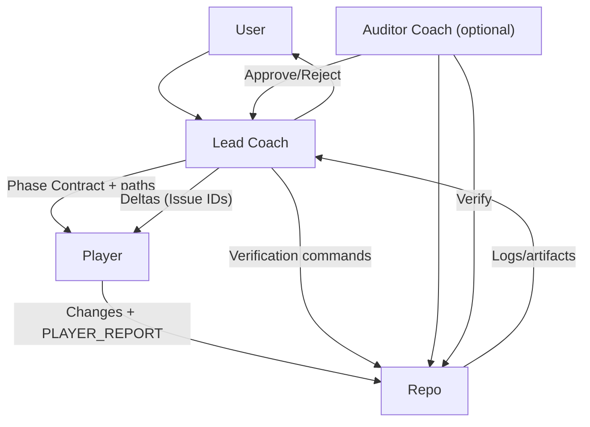

## Good format



## Bad format

```mermaid
graph TB
  U[User] --> LC[Lead Coach]
  LC --> U
  LC -- Phase Contract + paths --> P[Player]
  P -- Changes + PLAYER_REPORT --> R[Repo]
  LC -- Verification commands --> R
  R -- Logs/artifacts --> LC
  LC -- Deltas (Issue IDs) --> P
  AC[Auditor Coach\n(optional)] --> R
  AC -- Verify --> R
  AC -- Approve/Reject --> LC
```
