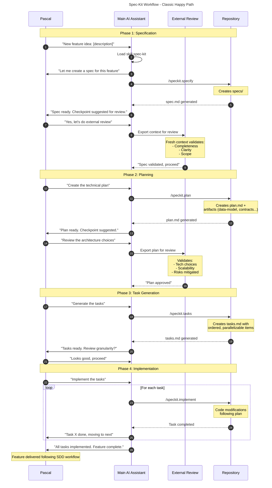

# Spec-Kit Workflow - Classic Happy Path

## Participants

| Participant       | Role                                                               |
| ----------------- | ------------------------------------------------------------------ |
| Pascal            | Human stakeholder driving the feature                              |
| Main AI Assistant | Orchestrates SDD workflow, executes /speckit.\* commands           |
| External Review   | Fresh context (new session/other AI) for validation at checkpoints |
| Repository        | Storage for all artifacts (specs/, plan.md, tasks.md, code)        |

## Phases

1. **Specification**: Idea becomes structured spec with acceptance criteria
2. **Planning**: Technical decisions, architecture, artifacts
3. **Task Generation**: Breakdown into executable work items
4. **Implementation**: Code generation following the plan
